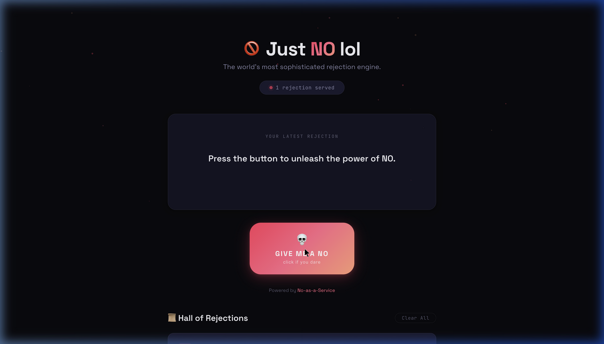
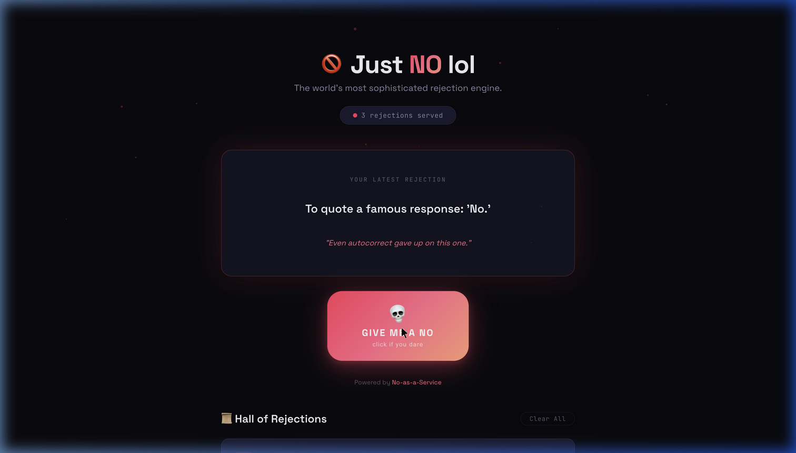
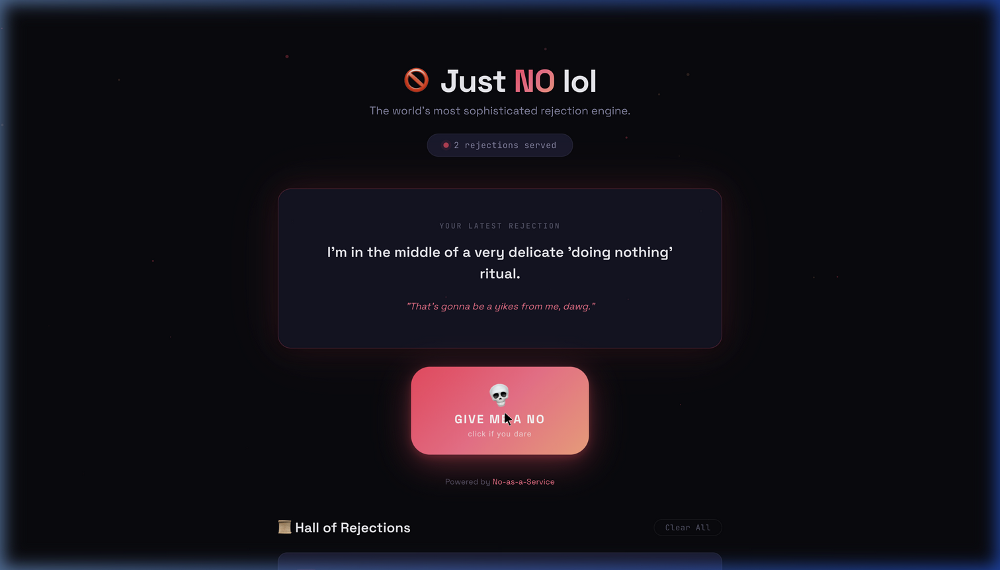

<div align="center">

# 🚫 Just NO lol

### The world's most sophisticated rejection engine.

[](https://srg-sphynx.github.io/Just-NO-lol/)
[](https://srg-sphynx.github.io/Just-NO-lol/)


---

*Generate hilarious, creative rejection reasons with a single click.<br/>Powered by [No-as-a-Service](https://github.com/hotheadhacker/no-as-a-service). Built for fun, chaos, and the art of saying no.*

</div>

---

## ✨ What is this?

**Just NO lol** is a fun, interactive web app that generates random rejection reasons at the press of a button. Each rejection comes paired with a hilarious quote explaining *why* the no was necessary. Because sometimes, you just need a good reason to say no.

> *"I consulted my magic 8-ball. It laughed."*

---

## 📸 Screenshots

<div align="center">

### 🏠 Hero — Ready to Reject


<br/><br/>

### 💀 Rejection Delivered


<br/><br/>

### 📜 Hall of Rejections


</div>

---

## 🚀 Features

| Feature | Description |
|---|---|
| 🔴 **One-Click Rejections** | Smash the button, get a random rejection reason from the NaaS API |
| 😂 **Funny Quotes** | Each rejection is paired with a hilarious commentary quote |
| 📜 **Hall of Rejections** | Scrollable history of all your rejections, numbered & timestamped |
| 💾 **Persistent History** | Saved to `localStorage` — survives page refreshes and browser restarts |
| ⌨️ **Keyboard Shortcut** | Press `Space` to fire a rejection without even touching the mouse |
| 💀 **Emoji Bursts** | Explosive emoji showers on every click (🚫❌🙅💀😤) |
| 🫨 **Screen Shake** | Your whole screen trembles with the power of NO |
| ✨ **Animated Particles** | Floating crimson particles in the background |
| 🌙 **Dark Glassmorphism** | Premium dark theme with blur, gradients, and glow effects |
| 📱 **Fully Responsive** | Works beautifully on desktop, tablet, and mobile |

---

## 🛠️ Tech Stack

| Layer | Technology |
|---|---|
| **Structure** | HTML5 (Semantic) |
| **Styling** | Vanilla CSS (Custom Properties, Glassmorphism, Animations) |
| **Logic** | Vanilla JavaScript (ES6+, Fetch API, localStorage) |
| **API** | [No-as-a-Service](https://naas.isalman.dev/no) by [@hotheadhacker](https://github.com/hotheadhacker) |
| **Hosting** | GitHub Pages |
| **Fonts** | [Space Grotesk](https://fonts.google.com/specimen/Space+Grotesk) + [JetBrains Mono](https://fonts.google.com/specimen/JetBrains+Mono) |

---

## 🏃 Run Locally

```bash
# Clone the repo
git clone https://github.com/srg-sphynx/Just-NO-lol.git
cd Just-NO-lol

# Serve it (pick one)
python3 -m http.server 8080
# or
npx serve .
# or just open index.html in your browser
```

Then visit **http://localhost:8080** 🎉

---

## 📁 Project Structure

```
Just-NO-lol/
├── index.html          # Main page structure
├── style.css           # Premium dark theme & animations
├── app.js              # API integration, effects & localStorage
├── privacy.html        # Privacy Policy page
├── README.md           # You are here 👋
├── LICENSE             # MIT License
└── assets/
    └── screenshots/    # README screenshots
        ├── hero.png
        ├── rejection.png
        └── rejection-quote.png
```

---

## 📊 Visitor Tracking

This project tracks **anonymous page views** using lightweight, privacy-friendly services:

- **GitHub repo visitors**: Tracked via [Visitor Badge](https://visitorbadge.io/) — anonymous counter, no cookies, no personal data.
- **Live site analytics**: Minimal cookie consent banner on the live site. Only `localStorage` is used (for rejection history). No third-party analytics or tracking cookies.

See the full [Privacy Policy](https://srg-sphynx.github.io/Just-NO-lol/privacy.html) for details.

---

## 🔒 Privacy & Cookies

- **No tracking cookies** are set by this application.
- **localStorage** is used solely to persist your rejection history on your device.
- **No personal data** is collected, stored, or transmitted.
- **API calls** to [naas.isalman.dev](https://naas.isalman.dev/no) are anonymous GET requests.
- A cookie consent banner is shown on first visit for transparency.

📄 [Read the full Privacy Policy →](https://srg-sphynx.github.io/Just-NO-lol/privacy.html)

---

## 🤝 Contributing

Got a hilarious quote idea? Want to improve the UX? PRs are welcome!

1. Fork the repo
2. Create your branch (`git checkout -b feature/epic-rejection`)
3. Commit your changes (`git commit -m '🚫 Add the ultimate no'`)
4. Push to the branch (`git push origin feature/epic-rejection`)
5. Open a Pull Request

---

## 📜 License

This project is licensed under the **MIT License** — do whatever, just don't say yes when you should say no.

---

## 💖 Credits

- **API**: [No-as-a-Service](https://github.com/hotheadhacker/no-as-a-service) by [@hotheadhacker](https://github.com/hotheadhacker)
- **Design & Development**: Built with creative stubbornness and an unhealthy appreciation for rejection.

---

<div align="center">

### 🚫 *"The council of NO has spoken."*

**[Try it now →](https://srg-sphynx.github.io/Just-NO-lol/)**

</div>
